# Applied Programming 
# 1.Tekenen
## 1.1.Tekenen valschermspringer
Voor een totaal beeld van mijn valschermspringer gebruik ik een Model3DGroup. 
De verschillende onderdelen: benen, armen, lichaam en hoofd maak ik met MeshGeometry3D. 
Mijn parachute wordt ook getekend met het type MeshGeometry3D. 
Voor ik begon met te tekenen van mijn valschermspringer en parachute heb ik eerst wat zitten opzoeken 
hoe het eigenlijk werk. Ik heb vooral informatie opgezocht via  [1] en ik heb het voorbeeld bij gepakt   
van uit de les WPF-demo Cube[2].
Dit is mijn schets dat ik heb getekend voor mijn valschermspringer te kunnen tekenen.  
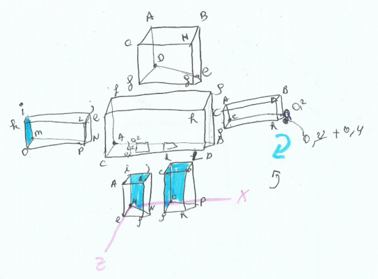
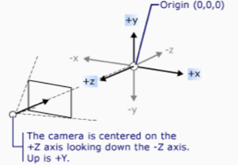

## 1.2.Tekenen parachute
Ik heb mijn parachute in 3 cirkels getekend en een toppunt. Voor mijn punten zit in een Point3DCollection. 
Elk punt wordt aangemaakt met Point3D.

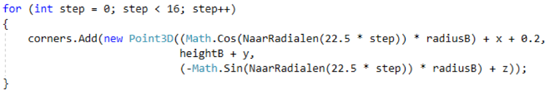


Dit is mijn eerste laag, het dicht bij zijnde van het middelpunt. Ik gebruik voor de x-as Cosinus. Ik zet de graden om naar radialen. 
90/4= 22.5 * stap. Per stap dat hij maakt in de forlus aantal punten rond het cirkel * straal van het cirkelB. 
Bij de cosinus tel ik ‘x’ bij op zodat hij meegaat met mijn valschermspringer. Daarnaast tel ik nog +0.2 bij op want anders stond het 
niet helemaal in het midden van mijn valschermspringer.

Mijn hoogte heb ik gewoon zelf gekozen en dan nog eens + y voor te meegaan met mijn valschermspringer.

Voor mijn diepte heb ik gewerkt met het negatieve van Sinus. Er voor heb ik een min geplaatst omdat het in de diepte is dat ik bereken 
en heb het zelfde herhaalt als bij mijn x-as. 


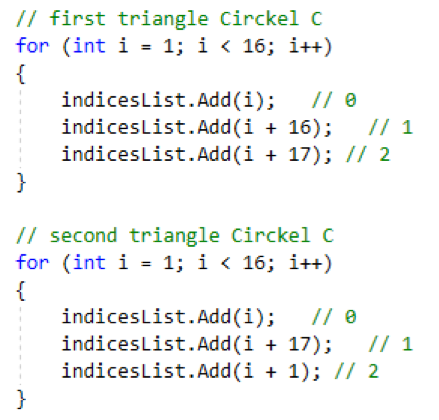
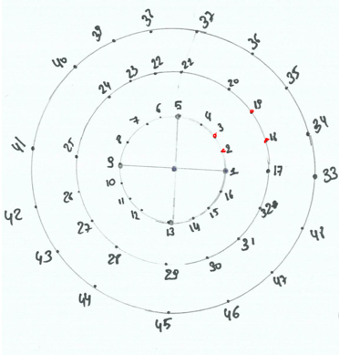  </br>


Voor mijn punten te verbinden met elkaar heb ik met driehoeken zitten werken. Die verbindingen steek ik in een List.  
Voor mijn eerste cirkel ben ik maar 1 keer met een forlus gegaan om te verbinden. Maar voor cirkelC & D heb ik twee keer
een forlus moeten gebruiken. Omdat ik daar vier punten(zie tekening) moet verbinden en bij cirkel B maar drie. 

Het verbinden van driehoeken moet tegenwijzerszin gaan. Dit is eigenlijk wat ik heb uitgevoerd voor cirkel C en D. [3]
 
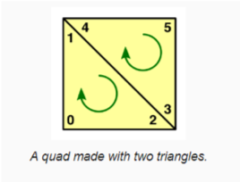


## 1.3. Schematisch voorstelling
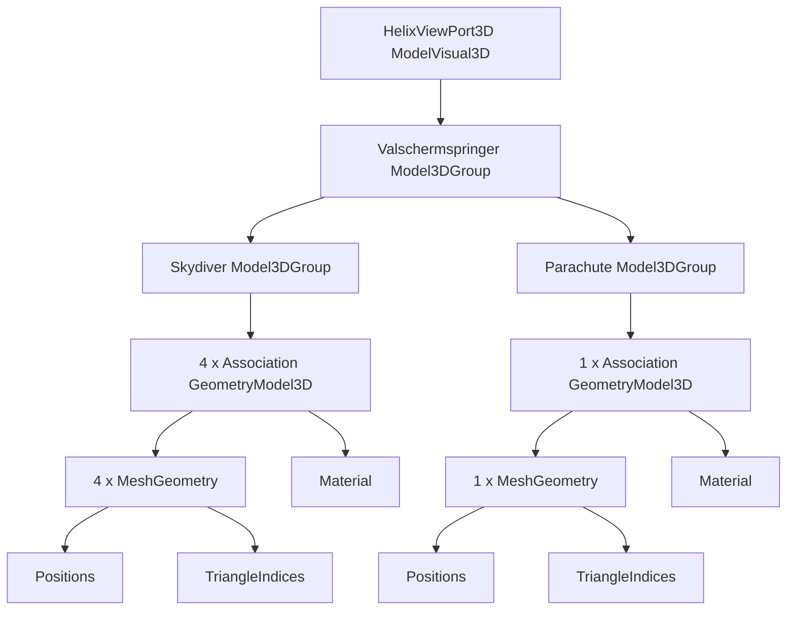
  
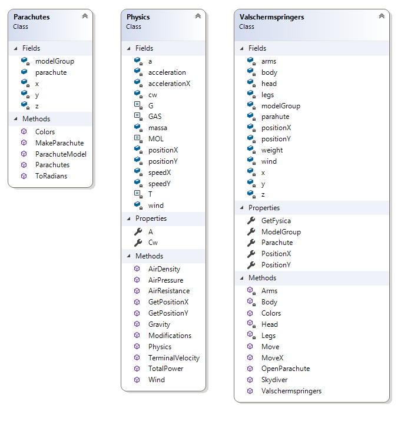   


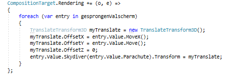

Voor de transformaties gebruik ik TranslateTransform3D dat ik dan gelijk stel aan mijn methode van Euler dat elke keer als er 
30 milliseconden passeert uitvoert. Ik gebruik CompositionTarget dat is een achtergrond Timer. Want bij een dispatchtimer 
ging mijn valschermspringers trager. De positie wordt bepaald door de methode van de Euler in mijn fysica.  

# 2. Fysica
Informatie uit fysica heb ik via de powerpoints van Workshop 2 slides.  
## 2.1. Zwaartekracht
Zwaartekracht heb ik berekend met deze formule
```math
F=m \cdot g
```

m: is de massa uitgedrukt in kg.
g: is de valversnelling uitgedrukt in m/s². Ongeveer op heel de aarde is het 9.81 dit is een assumptie.
Ik heb voor de valversnelling een min teken geplaatst omdat het valschermspringer naar beneden moet vallen. 
Want bij de totale kracht doe ik zwaartekracht + luchtweerstand. Dit is een constante.


## 2.2. Luchtweerstand
### 2.2.1. Luchtdruk
Eerst heb ik de luchtdruk berekent met formule 
 ```math
p(h) = p(0) \cdot e -(\dfrac{M g h}{R T})
```

p(0): de luchtdruk op zeeniveau is een constante. Ik heb de gemiddelde genomen en daarna * 100 gedaan, omdat het in hpascal staat en het moet naar pascal.[4]
M: massa van mol lucht 0,0288kg/mol is een constante  
R: de algemene gasconstante (8.31J/ mol K) is een constante  
h: positie wordt berekend door methode van Euler zie later  
g: valversnelling 9.81 is een constante  
T: temperatuur in Kelvin heb ik gedefinieerd als een constante 20 graden. [5]


### 2.2.2. Dichtheid lucht
Daarna heb de dichtheid  van lucht berekend dat afhankelijk is van de druk.
 
 ```math
Plucht = 3,46 \cdot 10^-3 \cdot \dfrac{p}{T}
```
P is de druk dat ik eerst heb berekend. De rest is allemaal constant.


### 2.2.3. Luchtweerstand
Voor luchtweerstand zelf gebruik ik deze formule met gebruik van dichtheid van het lucht.
  ```math
F = \dfrac{1}{2} \cdot p \cdot v^2 \cdot A \cdot C_w
```
 
p is de dichtheid van het lucht dat ik berekend had.  
v is de snelheid dat ik bereken in mijn methode van Euler zie later.  
A: is het oppervlakte van mijn valschermspringer loodrecht richting naar beneden (0.15)  
Cw: weerstandcoëfficiënt (1.05)  

## 2.3. Methode Euler 
Hier bereken ik de positie van y-as. Hoe het valschermspringer naar beneden valt.
TotalPower() is Zwaartekracht + Luchtweerstand dat ik had berekend.
deltaT is het snelheid 30milliseconden dat ik er aan heb gegeven.

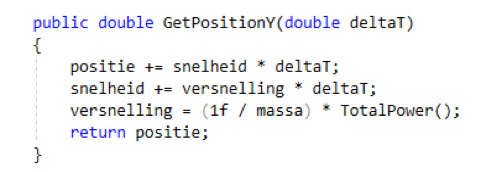


Voor de parachute heb ik nog een methode Modifications () 
Waar ik de oppervlakte op 28 zet en de weerstandscoëfficiënt op 0.47. 

# 3. Valschermspringer snelheid
De snelheid wordt wel constant maar met een kleine afwijking. Hoe lager hij i, hoe kleiner luchtweerstand zal 
zijn en dus daardoor niet helemaal constant kan blijven. De methode Euler zorgt dat deze nooit constant zal blijven. 
Ik bereken de eindsnelheid door deze formule dat ik gevonden heb op deze site [6]. Dus wanneer zwaartekracht gelijk 
is aan luchtweerstand zal de snelheid constant zijn.
  ```math
V_t=  \sqrt{\dfrac{2 \cdot m \cdot g}{p \cdot A \cdot C_w}}

```

Mijn valschermspringer zijn snelheid hangt af van hoeveel hij weegt en oppervlakte van het onderkant van mijn springer.  
Zijn gewicht kan je ingeven via UI. Als hij zijn parachute gaat openen, zal de oppervlakte groter worden dus zal mijn 
valschermspringer trager gaan dan normaal. 

Die aanpassingen gebeuren wanneer ik op P-toets druk. Dan zal er een methode worden opgeroepen worden ‘AddParachute’.
Hij zal kijken in mijn directory of er al een mannetje gesprongen als dat niet het geval is zal er geen parachute komen, 
maar als er wel een mannetje aan het vallen is zal er een parachute komen. 

Deze methode zal een andere methode oproepen van mijn klasse ‘Valschermspringer’.  Die controleert met een boolean 
of mijn parachute open is. Daarna gebeurt de aanpassingen dat ik dan oproep van mijn fysica. De oppervlakte en de
weerstandscoëfficiënt die ik heb aangepast.  

Je kan de berekeningen controleren. Ik heb ze allemaal in output laten uitdrukken.  


Rekenvoorbeeld met parachute  
m = 80 kg  
A = 28 m^2  
C_w = 0.47  
p = 1.20  

  ```math
9.97 m/s =  \sqrt{\dfrac{2 \cdot 80 \cdot 9.81}{1.20 \cdot 80 \cdot 28}}

```

 
# 4. Extra fysica wind
Als extra heb ik wind er in gedefinieerd met deze formule [7]
 ```math
F_w=  \dfrac{1}{2} \cdot p \cdot v^2 \cdot A

```

P is het dichtheid van het lucht   
V is het windkracht dat je ingeeft via de userinterface  
A is de oppervlakte van de valschermspringer  
Hier voor heb ik een extra methode van Euler aangemaakt voor de x-as.  

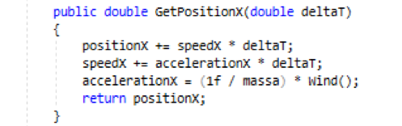


Er zal zeker wel wind zijn in de lucht ook al is dat maar heel weinig. Je kan zelf ingeven via de user interface hoeveel 
windkracht je wilt meter/s. Ik heb er ook een leuk geluidje ingestoken, wanneer het mannetje springt dat hij dan geluid maakt.

# 5. Conclusie
Het tekenen ging vloeiender dan ik had verwacht. Maar het fysica gedeelte ging wat lastiger, maar het is uiteindelijk wel gelukt.
Wat ik misschien beter gedaan zou hebben is misschien in plaats van P-toets, kunnen aanduiden welke parachute 
dat open zou moeten met een muisklik. Als een interessante uitbreiding kan ik misschien wel voor mijn extra fysica 
wind gedeelte. Een keuze laten maken voor welke windrichting dat de wind komt. Door mijn point Z overal te kunnen aanpassen.

# 6. References
 id | Auteur | Title | Link
------------ | ------------- | ------------ | -------------
1 | Microsoft | 3-D Graphics Overview | https://docs.microsoft.com/en-us/dotnet/framework/wpf/graphics-multimedia/3-d-graphics-overview
2 | AP les | Oefening WPF-demo | Cube
3 | Jasper Flick | Procedural Grid | https://catlikecoding.com/unity/tutorials/procedural-grid/
4 | Meteo |  De maandnormalen te Ukkel | https://www.meteo.be/meteo/view/nl/360955-Maandelijkse+normalen.html#ppt_16230361
5 | Metric Conversions | Celsius naar Kelvin | https://www.metric-conversions.org/nl/temperatuur/celsius-naar-kelvin.htm
6 | Wikipedia | Eindsnelheid | https://nl.wikipedia.org/wiki/Eindsnelheid?fbclid=IwAR3tjWmesQWZuw5_Ll3FxYG3Fj8JvL3eG7X_AhWeSrpb-wDc5-LDo8AIuBA
7 | Geen auteur | Wind Velocity and Wind Load | https://www.engineeringtoolbox.com/wind-load-d_1775.html


